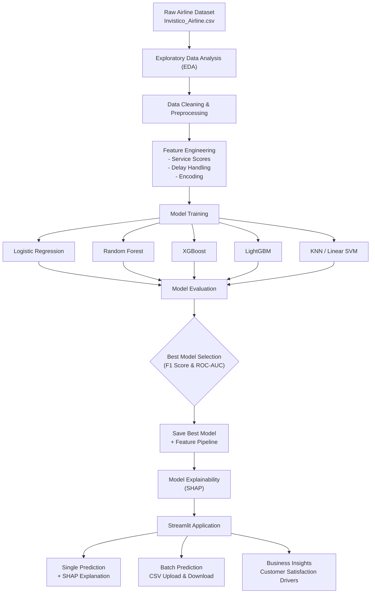

# Airline-Customer-Satisfaction

```mermaid
flowchart TD
    A["Raw Airline Dataset\nInvistico_Airline.csv"] --> B["Exploratory Data Analysis (EDA)"]

    B --> C["Data Cleaning & Preprocessing"]
    C --> D["Feature Engineering\n- Service Scores\n- Delay Handling\n- Encoding"]

    D --> E["Model Training"]
    E --> E1["Logistic Regression"]
    E --> E2["Random Forest"]
    E --> E3["XGBoost"]
    E --> E4["LightGBM"]
    E --> E5["KNN / Linear SVM"]

    E1 --> F["Model Evaluation"]
    E2 --> F
    E3 --> F
    E4 --> F
    E5 --> F

    F --> G{"Best Model Selection\n(F1 Score & ROC-AUC)"}

    G --> H["Save Best Model\n+ Feature Pipeline"]

    H --> I["Model Explainability\n(SHAP)"]

    I --> J["Streamlit Application"]

    J --> J1["Single Prediction\n+ SHAP Explanation"]
    J --> J2["Batch Prediction\nCSV Upload & Download"]

    J --> K["Business Insights\nCustomer Satisfaction Drivers"]
```
