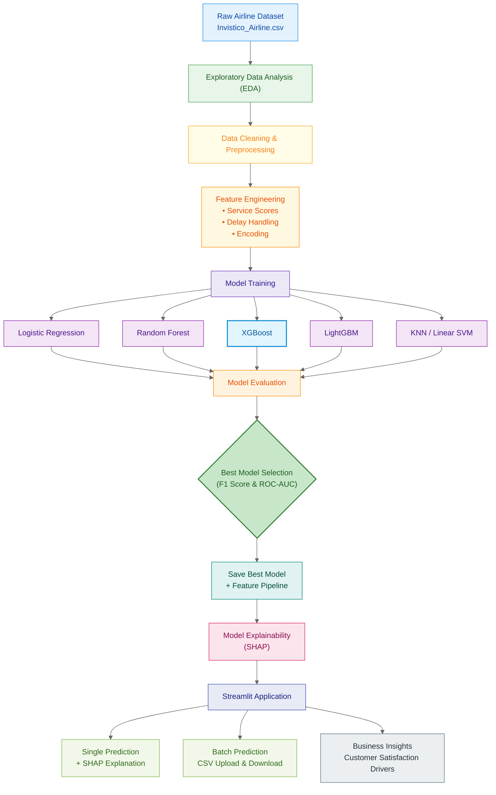
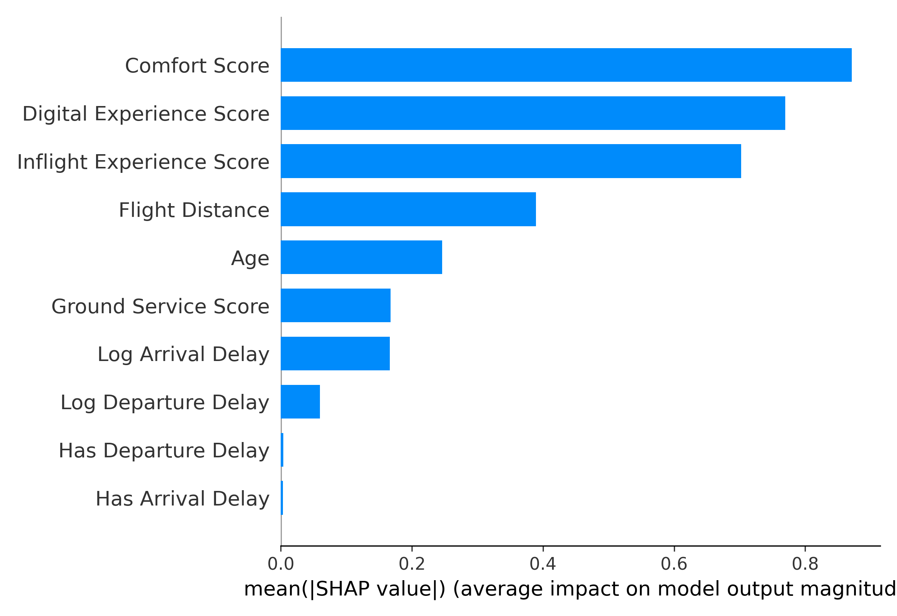
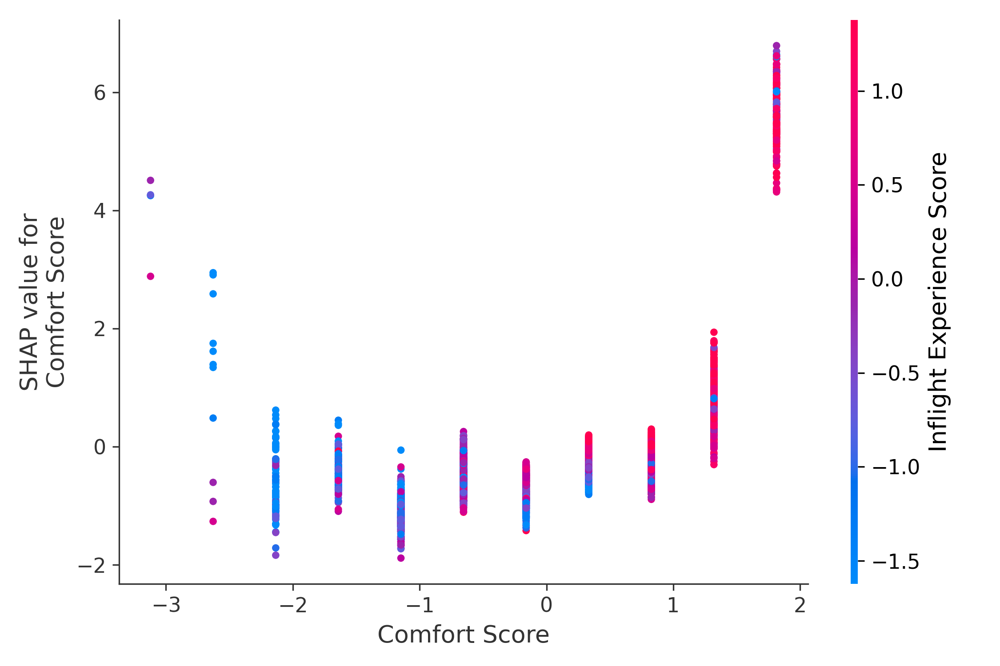
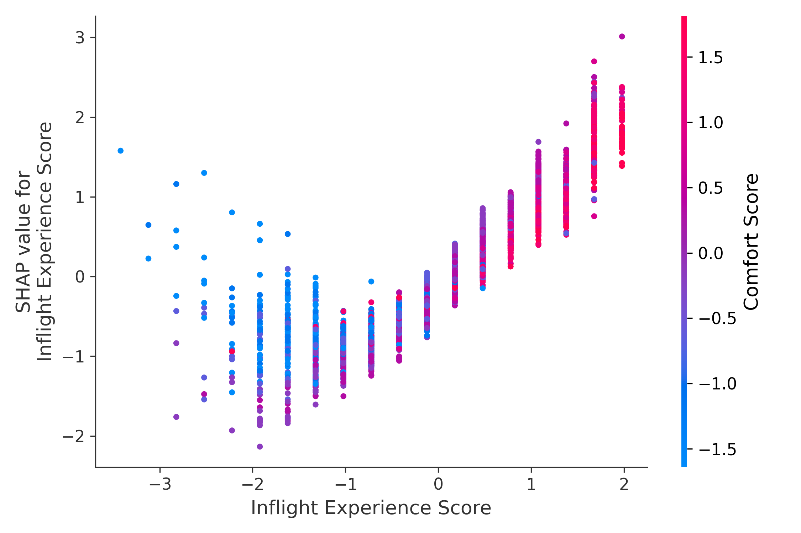
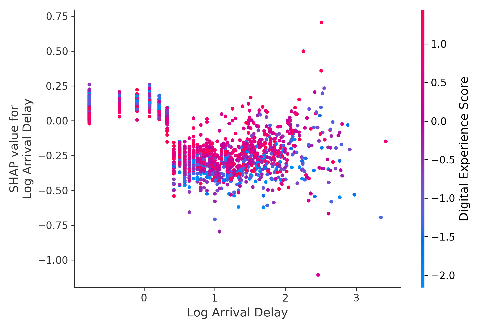

# ✈️ Airline Customer Satisfaction Prediction  
### End-to-End Machine Learning System with Explainability & Deployment

<p align="center">
  <b>
    Predict airline customer satisfaction, explain model decisions using SHAP,
    and deploy predictions via an interactive Streamlit application.
  </b>
</p>

<p align="center">
  <!-- Demo button (link will be added later) -->
  <a href="#">
    
  </a>
</p>

---

## 📌 Problem Statement

Airlines collect large volumes of customer feedback after every flight.  
However, converting this raw feedback into **actionable insights** is challenging.

### 🎯 Objective

Build an **industrial-grade machine learning system** that can:

- Predict whether a passenger is **Satisfied** or **Dissatisfied**
- Identify **key factors influencing satisfaction**
- Provide **transparent explanations** using SHAP
- Support **single and batch predictions**
- Be easily deployed and reused

---

## 📂 Dataset Overview

- **Source:** Kaggle (Invistico Airlines – anonymized)
- **Rows:** Passenger-level flight experiences
- **Features include:**
  - Demographics (Age, Gender)
  - Travel details (Class, Type of Travel, Distance)
  - Service ratings (Seat comfort, Food, Wi-Fi, etc.)
  - Delay information
- **Target:** `satisfaction`
  - `1` → Satisfied  
  - `0` → Dissatisfied

---

## 🔁 End-to-End Project Workflow


## 🔍 Exploratory Data Analysis (EDA)

EDA was conducted to understand:

- Satisfaction distribution (class balance)
- Impact of service ratings on satisfaction
- Effect of departure and arrival delays
- Differences between business and personal travel

### 🔑 Key Observations

- Service-related features dominate satisfaction
- Long delays strongly correlate with dissatisfaction
- Business class passengers show higher satisfaction
- Loyal customers are significantly more satisfied

> 📒 EDA notebook available at: `notebooks/01_eda.ipynb`

---

## 🧠 Feature Engineering

Industry-standard feature engineering techniques were applied:

- Robust preprocessing using pipelines
- Handling of categorical and numerical features
- Delay-aware feature handling
- Train/inference-safe transformations

All transformations are stored inside a **single reusable feature pipeline**, ensuring
consistency between training and inference.

---

## 🤖 Model Training & Evaluation

Multiple models were trained and compared using consistent evaluation metrics to
ensure a fair and reliable selection process.

### 📊 Model Comparison Table

| Model               | Accuracy | Precision | Recall | F1 Score | ROC-AUC |
|--------------------|----------|-----------|--------|----------|---------|
| XGBoost            | 0.829    | 0.851     | 0.834  | 0.843    | 0.910   |
| LightGBM           | 0.826    | 0.865     | 0.807  | 0.835    | 0.908   |
| Random Forest      | 0.824    | 0.859     | 0.812  | 0.835    | 0.903   |
| KNN                | 0.810    | 0.831     | 0.820  | 0.825    | 0.888   |
| Decision Tree      | 0.812    | 0.853     | 0.793  | 0.822    | 0.878   |
| Logistic Regression| 0.769    | 0.793     | 0.781  | 0.787    | 0.838   |
| Linear SVM         | 0.766    | 0.790     | 0.780  | 0.785    | 0.834   |

---

## 🏆 Best Model Selection

**XGBoost** was selected as the final model due to:

- Highest F1 Score
- Strong ROC-AUC performance
- Stable results across multiple stress-test scenarios

---

## 🔎 Model Explainability (SHAP)

To ensure transparency and trust in model predictions, **SHAP (SHapley Additive exPlanations)** was used
to interpret both **global** and **local** model behavior.

---

### 📊 Global Feature Importance

The following plot shows the **overall importance of features** across all predictions.
Features at the top have the strongest influence on customer satisfaction.



---

### 🧠 SHAP Summary Plot

This plot provides a **holistic view** of how feature values impact predictions:

- Color indicates feature value (low → high)
- Position indicates impact on satisfaction prediction


---

### 🔍 Feature-Level Dependence Analysis

These plots illustrate **how specific features influence predictions** at different values.

#### 1️⃣ Comfort Score Impact
Shows how overall seat and comfort-related services affect satisfaction.



---

#### 2️⃣ Digital Experience Impact
Represents the influence of online booking, Wi-Fi, and digital services.


---

#### 3️⃣ Inflight Experience Impact
Highlights the effect of entertainment, food, and onboard services.



---

#### 4️⃣ Arrival Delay Impact (Log Scale)
Demonstrates how increasing arrival delays sharply increase dissatisfaction.



---

### 🔑 Key Explainability Insights

- Comfort and inflight experience are the **strongest drivers** of satisfaction
- Digital experience significantly affects customer perception
- Even moderate arrival delays drastically reduce satisfaction
- Service quality can partially offset delay-related dissatisfaction

These insights make the model **business-interpretable**, enabling data-driven service improvements.

---

## 🚀 Streamlit Application

The project includes a **production-ready Streamlit application** with the following features:

### 👤 Single Prediction

- Manual passenger input
- Satisfaction prediction (Satisfied / Dissatisfied)
- SHAP explanation for that specific prediction

### 📁 Batch Prediction

- CSV file upload
- Predict satisfaction for thousands of passengers
- Download predictions instantly

---

## 🧰 Tech Stack

### Languages & Core
- Python 3.10+
- NumPy
- Pandas

### Visualization
- Matplotlib
- Seaborn
- SHAP

### Machine Learning
- Scikit-learn
- XGBoost
- LightGBM

### Deployment
- Streamlit
- Joblib

---

## ▶️ How to Run the Project Locally

Follow the steps below to set up and run the project on your local machine.

---

### 1️⃣ Clone the Repository

```bash
git clone https://github.com/VenkateshHJoshi/Airline-Customer-Satisfaction.git
cd Airline-Customer-Satisfaction
```

### 2️⃣ Create and Activate a Virtual Environment
It is recommended to use a virtual environment to manage dependencies.
```bash
python -m venv .venv
```
Activate the environment:
- macOS / Linux
```bash
source .venv/bin/activate
```
- Windows
```bash
.venv\Scripts\activate
```

### 3️⃣ Install Required Dependencies
```bash
pip install -r requirements.txt
```

### 4️⃣ (Optional) Train Models from Scratch
If you want to retrain all models and reselect the best one:

```bash
python -m src.models.train_and_select_model
```
This will:

- Train multiple models

- Evaluate them using standard metrics

- Select the best-performing model

- Save the trained model and feature pipeline

> ⚠️ If you skip this step, the pre-trained models included in the repository will be used.

### 5️⃣ Run the Streamlit Application
```bash
streamlit run app/app.py
```
Once the app starts, open your browser and navigate to:
```bash
http://localhost:8501
```
You can now:

- Perform single passenger predictions

- Upload CSV files for batch predictions

- View SHAP-based explanations for model decisions

### 🤝 Contributing & Improving the Project
If you find this project interesting and would like to improve or extend it, contributions are welcome.

You can:

- Add new features or advanced models

- Improve feature engineering or evaluation strategies

- Enhance the Streamlit UI/UX

- Add monitoring, retraining, or deployment pipelines

- Improve documentation or visualizations

🚀 Get Started

- Fork this repository

- Create a new feature branch

- Make your improvements

- Submit a pull request

Your contributions can help make this project even more robust and impactful.