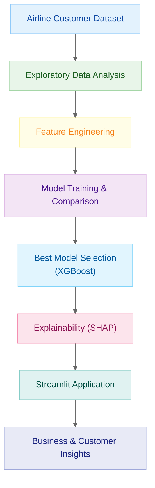

# Airline-Customer-Satisfaction

```mermaid
%%{init: {'theme': 'neutral'}}%%
flowchart TD

    A["Airline Customer Dataset"]:::data

    B["Exploratory Data Analysis"]:::process
    C["Feature Engineering"]:::feature

    D["Model Training & Comparison"]:::model
    E["Best Model Selection<br/>(XGBoost)"]:::best

    F["Explainability (SHAP)"]:::explain

    G["Streamlit Application"]:::deploy
    H["Business & Customer Insights"]:::business

    %% FLOW
    A --> B
    B --> C
    C --> D
    D --> E
    E --> F
    F --> G
    G --> H

    %% STYLES (Soft, readable, premium)
    classDef data fill:#E3F2FD,stroke:#90CAF9,color:#0D47A1
    classDef process fill:#E8F5E9,stroke:#A5D6A7,color:#1B5E20
    classDef feature fill:#FFFDE7,stroke:#FFF59D,color:#F57F17
    classDef model fill:#F3E5F5,stroke:#CE93D8,color:#4A148C
    classDef best fill:#E1F5FE,stroke:#81D4FA,color:#01579B
    classDef explain fill:#FCE4EC,stroke:#F48FB1,color:#880E4F
    classDef deploy fill:#E0F2F1,stroke:#80CBC4,color:#004D40
    classDef business fill:#E8EAF6,stroke:#9FA8DA,color:#1A237E
```
