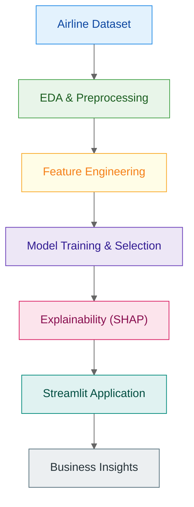

# Airline-Customer-Satisfaction

```mermaid
%%{init: {'theme': 'neutral'}}%%
flowchart TD

    A["Airline Dataset"]:::data
    B["EDA & Preprocessing"]:::process
    C["Feature Engineering"]:::feature
    D["Model Training & Selection"]:::model
    E["Explainability (SHAP)"]:::explain
    F["Streamlit Application"]:::deploy
    G["Business Insights"]:::business

    A --> B
    B --> C
    C --> D
    D --> E
    E --> F
    F --> G

    %% STYLES (CLEAN & SOFT)
    classDef data fill:#E3F2FD,stroke:#1E88E5,color:#0D47A1
    classDef process fill:#E8F5E9,stroke:#43A047,color:#1B5E20
    classDef feature fill:#FFFDE7,stroke:#F9A825,color:#F57F17
    classDef model fill:#EDE7F6,stroke:#673AB7,color:#311B92
    classDef explain fill:#FCE4EC,stroke:#D81B60,color:#880E4F
    classDef deploy fill:#E0F2F1,stroke:#00897B,color:#004D40
    classDef business fill:#ECEFF1,stroke:#546E7A,color:#263238
```
