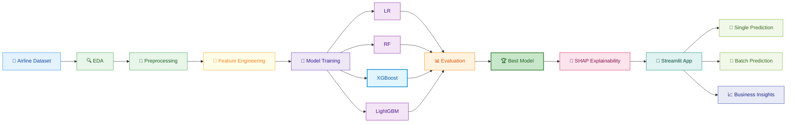

# Airline-Customer-Satisfaction

```mermaid
%%{init: {'theme': 'default', 'flowchart': {'curve': 'basis'}}}%%
flowchart LR

    %% DATA BLOCK
    A["📂 Airline Dataset"]:::data --> B["🔍 EDA"]:::process
    B --> C["🧹 Preprocessing"]:::process
    C --> D["🧠 Feature Engineering"]:::feature

    %% MODEL BLOCK
    D --> E["🤖 Model Training"]:::model
    E --> E1["LR"]:::modelAlt
    E --> E2["RF"]:::modelAlt
    E --> E3["XGBoost"]:::modelBest
    E --> E4["LightGBM"]:::modelAlt

    %% SELECTION
    E1 --> F["📊 Evaluation"]:::eval
    E2 --> F
    E3 --> F
    E4 --> F

    F --> G["🏆 Best Model"]:::best

    %% DEPLOYMENT
    G --> H["🔎 SHAP Explainability"]:::explain
    H --> I["🚀 Streamlit App"]:::deploy

    %% APP FEATURES
    I --> I1["👤 Single Prediction"]:::app
    I --> I2["📁 Batch Prediction"]:::app

    %% BUSINESS
    I --> J["📈 Business Insights"]:::business


    %% STYLES
    classDef data fill:#E3F2FD,stroke:#1E88E5,stroke-width:1px,color:#0D47A1
    classDef process fill:#E8F5E9,stroke:#43A047,stroke-width:1px,color:#1B5E20
    classDef feature fill:#FFFDE7,stroke:#F9A825,stroke-width:1px,color:#F57F17
    classDef model fill:#EDE7F6,stroke:#673AB7,stroke-width:1px,color:#311B92
    classDef modelAlt fill:#F3E5F5,stroke:#8E24AA,stroke-width:1px,color:#4A148C
    classDef modelBest fill:#E1F5FE,stroke:#0288D1,stroke-width:2px,color:#01579B
    classDef eval fill:#FFF3E0,stroke:#FB8C00,stroke-width:1px,color:#E65100
    classDef best fill:#C8E6C9,stroke:#2E7D32,stroke-width:2px,color:#1B5E20
    classDef explain fill:#FCE4EC,stroke:#D81B60,stroke-width:1px,color:#880E4F
    classDef deploy fill:#E0F2F1,stroke:#00897B,stroke-width:1px,color:#004D40
    classDef app fill:#F1F8E9,stroke:#7CB342,stroke-width:1px,color:#33691E
    classDef business fill:#E8EAF6,stroke:#3F51B5,stroke-width:1px,color:#1A237E
```
