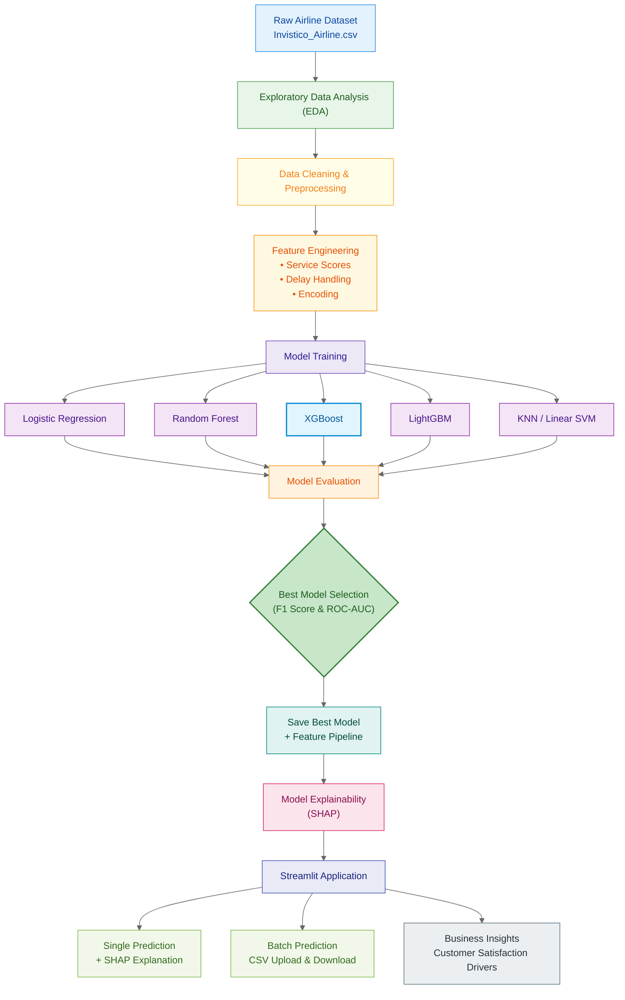

# ✈️ Airline Customer Satisfaction Prediction  
### End-to-End Machine Learning System with Explainability & Deployment

  <b>
    Predict airline customer satisfaction, explain model decisions using SHAP,
    and deploy predictions via an interactive Streamlit application.
  </b>

  <!-- Demo button (link will be added later) -->
  

---

## 📌 Problem Statement

Airlines collect large volumes of customer feedback after every flight.  
However, converting this raw feedback into **actionable insights** is challenging.

### 🎯 Objective

Build an **industrial-grade machine learning system** that can:

- Predict whether a passenger is **Satisfied** or **Dissatisfied**
- Identify **key factors influencing satisfaction**
- Provide **transparent explanations** using SHAP
- Support **single and batch predictions**
- Be easily deployed and reused

---

## 📂 Dataset Overview

- **Source:** Kaggle (Invistico Airlines – anonymized)
- **Rows:** Passenger-level flight experiences
- **Features include:**
  - Demographics (Age, Gender)
  - Travel details (Class, Type of Travel, Distance)
  - Service ratings (Seat comfort, Food, Wi-Fi, etc.)
  - Delay information
- **Target:** `satisfaction`
  - `1` → Satisfied  
  - `0` → Dissatisfied

---

## 🔁 End-to-End Project Workflow

