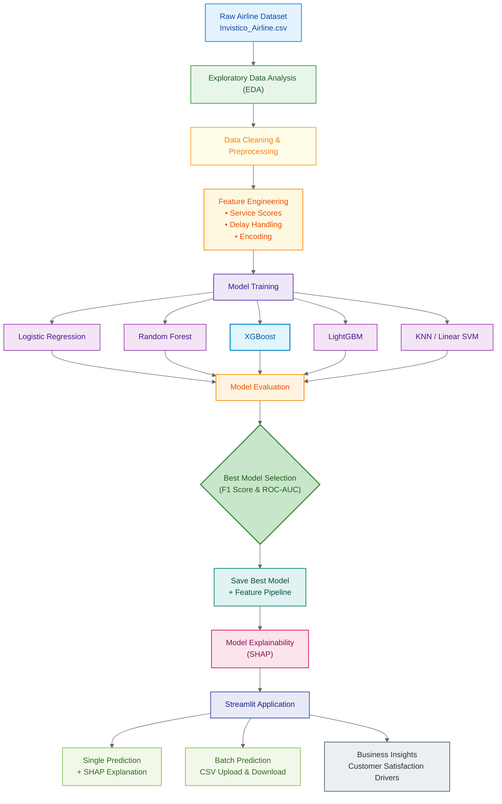

# Airline-Customer-Satisfaction

```mermaid
%%{init: {'theme': 'neutral'}}%%
flowchart TD

    A["Raw Airline Dataset\nInvistico_Airline.csv"]:::data --> B["Exploratory Data Analysis (EDA)"]:::eda

    B --> C["Data Cleaning & Preprocessing"]:::process
    C --> D["Feature Engineering\n• Service Scores\n• Delay Handling\n• Encoding"]:::feature

    D --> E["Model Training"]:::model
    E --> E1["Logistic Regression"]:::modelAlt
    E --> E2["Random Forest"]:::modelAlt
    E --> E3["XGBoost"]:::modelBest
    E --> E4["LightGBM"]:::modelAlt
    E --> E5["KNN / Linear SVM"]:::modelAlt

    E1 --> F["Model Evaluation"]:::eval
    E2 --> F
    E3 --> F
    E4 --> F
    E5 --> F

    F --> G{"Best Model Selection\n(F1 Score & ROC-AUC)"}:::best

    G --> H["Save Best Model\n+ Feature Pipeline"]:::save

    H --> I["Model Explainability\n(SHAP)"]:::explain

    I --> J["Streamlit Application"]:::deploy

    J --> J1["Single Prediction\n+ SHAP Explanation"]:::app
    J --> J2["Batch Prediction\nCSV Upload & Download"]:::app

    J --> K["Business Insights\nCustomer Satisfaction Drivers"]:::business


    %% COLOR STYLES (SOFT + PREMIUM)
    classDef data fill:#E3F2FD,stroke:#1E88E5,stroke-width:1.5px,color:#0D47A1
    classDef eda fill:#E8F5E9,stroke:#43A047,stroke-width:1.5px,color:#1B5E20
    classDef process fill:#FFFDE7,stroke:#F9A825,stroke-width:1.5px,color:#F57F17
    classDef feature fill:#FFF8E1,stroke:#FB8C00,stroke-width:1.5px,color:#E65100
    classDef model fill:#EDE7F6,stroke:#673AB7,stroke-width:1.5px,color:#311B92
    classDef modelAlt fill:#F3E5F5,stroke:#8E24AA,stroke-width:1.2px,color:#4A148C
    classDef modelBest fill:#E1F5FE,stroke:#0288D1,stroke-width:2px,color:#01579B
    classDef eval fill:#FFF3E0,stroke:#FB8C00,stroke-width:1.5px,color:#E65100
    classDef best fill:#C8E6C9,stroke:#2E7D32,stroke-width:2px,color:#1B5E20
    classDef save fill:#E0F2F1,stroke:#00897B,stroke-width:1.5px,color:#004D40
    classDef explain fill:#FCE4EC,stroke:#D81B60,stroke-width:1.5px,color:#880E4F
    classDef deploy fill:#E8EAF6,stroke:#3F51B5,stroke-width:1.5px,color:#1A237E
    classDef app fill:#F1F8E9,stroke:#7CB342,stroke-width:1.2px,color:#33691E
    classDef business fill:#ECEFF1,stroke:#546E7A,stroke-width:1.5px,color:#263238
```
