# ✈️ Airline Customer Satisfaction Prediction  
### End-to-End Machine Learning System with Explainability & Deployment

<p align="center">
  <b>
    Predict airline customer satisfaction, explain model decisions using SHAP,
    and deploy predictions via an interactive Streamlit application.
  </b>
</p>

<p align="center">
  <!-- Demo button (link will be added later) -->
  <a href="#">
    
  </a>
</p>

---

## 📌 Problem Statement

Airlines collect large volumes of customer feedback after every flight.  
However, converting this raw feedback into **actionable insights** is challenging.

### 🎯 Objective

Build an **industrial-grade machine learning system** that can:

- Predict whether a passenger is **Satisfied** or **Dissatisfied**
- Identify **key factors influencing satisfaction**
- Provide **transparent explanations** using SHAP
- Support **single and batch predictions**
- Be easily deployed and reused

---

## 📂 Dataset Overview

- **Source:** Kaggle (Invistico Airlines – anonymized)
- **Rows:** Passenger-level flight experiences
- **Features include:**
  - Demographics (Age, Gender)
  - Travel details (Class, Type of Travel, Distance)
  - Service ratings (Seat comfort, Food, Wi-Fi, etc.)
  - Delay information
- **Target:** `satisfaction`
  - `1` → Satisfied  
  - `0` → Dissatisfied

---

## 🔁 End-to-End Project Workflow

```mermaid
%%{init: {'theme': 'neutral'}}%%
flowchart TD

    A["Raw Airline Dataset
Invistico_Airline.csv"]:::data --> B["Exploratory Data Analysis (EDA)"]:::eda

    B --> C["Data Cleaning & Preprocessing"]:::process
    C --> D["Feature Engineering
• Service Scores
• Delay Handling
• Encoding"]:::feature

    D --> E["Model Training"]:::model
    E --> E1["Logistic Regression"]:::modelAlt
    E --> E2["Random Forest"]:::modelAlt
    E --> E3["XGBoost"]:::modelBest
    E --> E4["LightGBM"]:::modelAlt
    E --> E5["KNN / Linear SVM"]:::modelAlt

    E1 --> F["Model Evaluation"]:::eval
    E2 --> F
    E3 --> F
    E4 --> F
    E5 --> F

    F --> G{"Best Model Selection
(F1 Score & ROC-AUC)"}:::best

    G --> H["Save Best Model
+ Feature Pipeline"]:::save

    H --> I["Model Explainability
(SHAP)"]:::explain

    I --> J["Streamlit Application"]:::deploy

    J --> J1["Single Prediction
+ SHAP Explanation"]:::app
    J --> J2["Batch Prediction
CSV Upload & Download"]:::app

    J --> K["Business Insights
Customer Satisfaction Drivers"]:::business

    classDef data fill:#E3F2FD,stroke:#1E88E5,color:#0D47A1
    classDef eda fill:#E8F5E9,stroke:#43A047,color:#1B5E20
    classDef process fill:#FFFDE7,stroke:#F9A825,color:#F57F17
    classDef feature fill:#FFF8E1,stroke:#FB8C00,color:#E65100
    classDef model fill:#EDE7F6,stroke:#673AB7,color:#311B92
    classDef modelAlt fill:#F3E5F5,stroke:#8E24AA,color:#4A148C
    classDef modelBest fill:#E1F5FE,stroke:#0288D1,stroke-width:2px,color:#01579B
    classDef eval fill:#FFF3E0,stroke:#FB8C00,color:#E65100
    classDef best fill:#C8E6C9,stroke:#2E7D32,stroke-width:2px,color:#1B5E20
    classDef save fill:#E0F2F1,stroke:#00897B,color:#004D40
    classDef explain fill:#FCE4EC,stroke:#D81B60,color:#880E4F
    classDef deploy fill:#E8EAF6,stroke:#3F51B5,color:#1A237E
    classDef app fill:#F1F8E9,stroke:#7CB342,color:#33691E
    classDef business fill:#ECEFF1,stroke:#546E7A,color:#263238
```


### 🔍 Exploratory Data Analysis (EDA)

EDA was conducted to understand overall data distribution, feature behavior,
and their relationship with customer satisfaction.

### 📊 Key Visualizations

**1. Satisfaction Distribution (Class Balance)**  
Helps identify class imbalance and guides metric selection (F1, ROC-AUC).


---

**2. Service Ratings vs Satisfaction**  
Shows how service quality features (seat comfort, food, entertainment, etc.)
influence customer satisfaction.


---

**3. Delay Impact Analysis**  
Analyzes how departure and arrival delays affect dissatisfaction rates.


---

**4. Travel Type Comparison**  
Compares satisfaction trends between business and personal travelers.


---

### 🔑 Key Observations

- Service-related features dominate satisfaction outcomes
- Long delays strongly correlate with dissatisfaction
- Business class passengers show higher satisfaction levels
- Loyal customers are significantly more satisfied

> 📒 Detailed EDA notebook available at: `notebooks/01_eda.ipynb`

---

## 🧠 Feature Engineering

Industry-standard feature engineering techniques were applied:

- Robust preprocessing using pipelines
- Handling of categorical and numerical features
- Delay-aware feature handling
- Train/inference-safe transformations

All transformations are stored inside a **single reusable feature pipeline**, ensuring
consistency between training and inference.

---

## 🤖 Model Training & Evaluation

Multiple models were trained and compared using consistent evaluation metrics to
ensure a fair and reliable selection process.

### 📊 Model Comparison Table

| Model               | Accuracy | Precision | Recall | F1 Score | ROC-AUC |
|--------------------|----------|-----------|--------|----------|---------|
| XGBoost            | 0.829    | 0.851     | 0.834  | 0.843    | 0.910   |
| LightGBM           | 0.826    | 0.865     | 0.807  | 0.835    | 0.908   |
| Random Forest      | 0.824    | 0.859     | 0.812  | 0.835    | 0.903   |
| KNN                | 0.810    | 0.831     | 0.820  | 0.825    | 0.888   |
| Decision Tree      | 0.812    | 0.853     | 0.793  | 0.822    | 0.878   |
| Logistic Regression| 0.769    | 0.793     | 0.781  | 0.787    | 0.838   |
| Linear SVM         | 0.766    | 0.790     | 0.780  | 0.785    | 0.834   |

---

## 🏆 Best Model Selection

**XGBoost** was selected as the final model due to:

- Highest F1 Score
- Strong ROC-AUC performance
- Stable results across multiple stress-test scenarios

---

## 🔎 Model Explainability (SHAP)

To ensure transparency and trust in predictions:

- SHAP explains **individual predictions**
- Shows feature contributions (positive & negative impact)
- Integrated directly inside the Streamlit application

This enables **business-friendly interpretability** and informed decision-making.

---

## 🚀 Streamlit Application

The project includes a **production-ready Streamlit application** with the following features:

### 👤 Single Prediction

- Manual passenger input
- Satisfaction prediction (Satisfied / Dissatisfied)
- SHAP explanation for that specific prediction

### 📁 Batch Prediction

- CSV file upload
- Predict satisfaction for thousands of passengers
- Download predictions instantly

---

## 🧰 Tech Stack

### Languages & Core
- Python 3.10+
- NumPy
- Pandas

### Visualization
- Matplotlib
- Seaborn
- SHAP

### Machine Learning
- Scikit-learn
- XGBoost
- LightGBM

### Deployment
- Streamlit
- Joblib

---

## ▶️ How to Run the Project Locally

### 1️⃣ Clone the Repository
```bash
git clone <your-repository-url>
cd airline-customer-satisfaction
